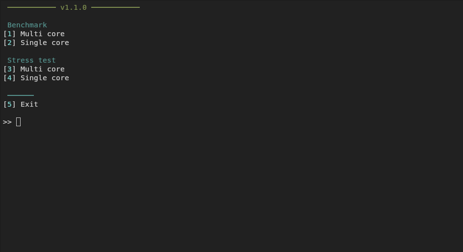
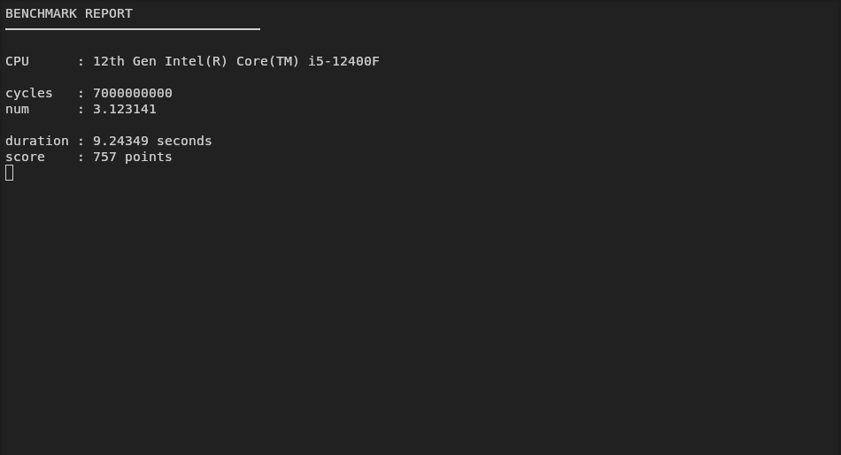

# CPU Benchmark

<p align="left">


</p>

<p>


</p>

CPU benchmarking tool written in C++23 to measure single-core and multi-core performance.

## Features

- Multi-core and single-core benchmarking
- Loading bar animation while benchmarking
- Results printed to console and saved to `Result.log`
- Configurable cycles and number using `config/config.txt`
- Stress test




## Configuration
Edit config/config.txt to adjust benchmarking parameters:
- cycles = 7000000000
- num = 3.123141

cycles: Total iterations to perform  
num: Base number used in computation

## Benchmark Results

> All results measured with default config  
> Higher score = better performance

| CPU | Cores / Threads | Multi-Core | Single-Core |
|-----|----------------|-----------|------------|
| Intel Core i5-12400F | 6 / 12 | 973 | 159 |
| | | | |


> Want to add your result? Open an issue or pull request with your CPU model and score!

## Dependencies
 
This project uses the [ConfigLoader](https://github.com/dixe1/config-loader) library for parsing the configuration file.

## Requirements

- C++23 compatible compiler
- CMake 3.10 or higher
- Git (optional, for cloning)

## Build

### 1. Clone the repository
```bash
git clone https://github.com/dixe1/CPU-Benchmark.git
cd CPU-Benchmark
```

### 2. Build Project

#### For Visual Studio 2022:
```bash
cmake -G "Visual Studio 17 2022" -A x64 . -B build
```

#### For Visual Studio 2019:
```bash
cmake -G "Visual Studio 16 2019" -A x64 . -B build
```

#### For Linux / macOS (Unix Makefiles):
```bash
cmake -G "Unix Makefiles" -B build
cmake --build build
```
### 3. Move config folder to built
Move folder "config" from "CPU-Benchmark" to folder where is your binary


