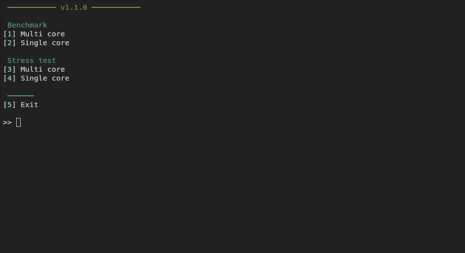
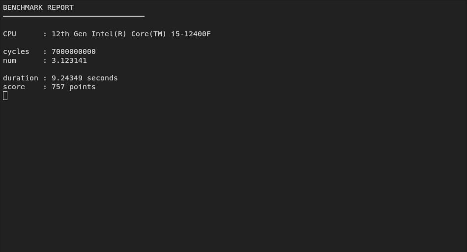

# CPU Benchmark

<p align="left">


</p>

<p>


</p>

CPU benchmarking tool written in C++23 to measure single-core and multi-core performance.

## Core algorithm

### Normal:

$$\large N = \frac{\text{Config::cycles}}{\text{threads}}$$
$$\large \sum_{i=0}^{N-1} \sin\left (\text{Config::num} + i \cdot 0.001 + 1\right)$$

### Stress test:

$$\large \sum_{i=0}^{\infty} \sin\left (\text{Config::num} + i \cdot 0.001 + 1\right)$$

## Benchmark Results

> All results measured with default config  
> Higher score = better performance

| CPU                    | Cores / Threads | Multi-Core | Single-Core |
|------------------------|-----------------|------------|-------------|
| Intel Core i5-12400F   | 6 / 12          | 973        | 159         |
| Intel Core 2 Duo T6670 | 2 / 2           | 30         | 16          |

> Want to add your result? Open an issue or pull request with your CPU model and score!

## User interface

You can start benchmark from the terminal like `/Benchmark --benchmark --multi-core` or open program without any arguments
and use build-in menu  
For more info: [arguments documentation](docs/COMMAND_LINE_ARGUMENTS.md)

---




## Requirements

- C++23 compatible compiler
- CMake 3.10 or higher
- Git (optional, for cloning)

## Build

### 1. Clone the repository

```bash
git clone https://github.com/dixe1/CPU-Benchmark.git
cd CPU-Benchmark
```

### 2. Build Project

#### For Visual Studio 2022:

```bash
cmake -G "Visual Studio 17 2022" -A x64 . -B build
```

#### For Visual Studio 2019:

```bash
cmake -G "Visual Studio 16 2019" -A x64 . -B build
```

#### For Linux / macOS (Unix Makefiles):

```bash
cmake -G "Unix Makefiles" -B build
cmake --build build
```

## License

This project is licensed under the MIT License.
