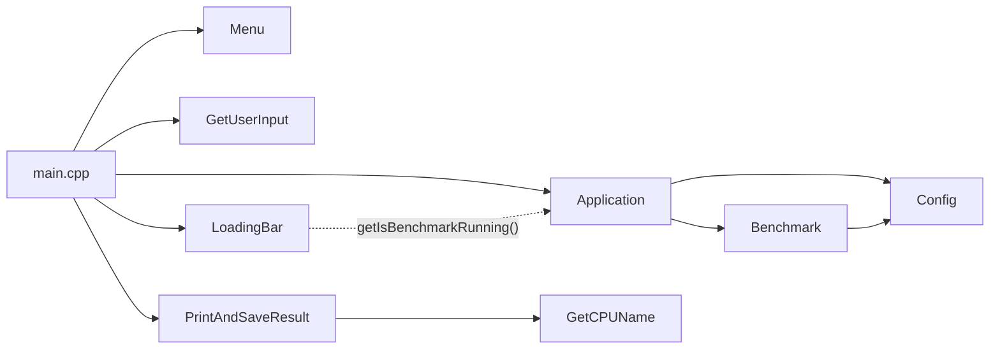

# Architecture

## Main classes

### [Application](../src/Application.cpp)
Owns the state of a single benchmark run (duration, points, running flag).
Runs [Benchmark](#benchmark) and turns its duration into a points.

### [Benchmark](../src/Benchmark.cpp)
Runs the actual computation:
- spawns one worker threads,
- starts and stops the timer,
- executes the loop in each thread (limited for benchmark, infinite for stress test).